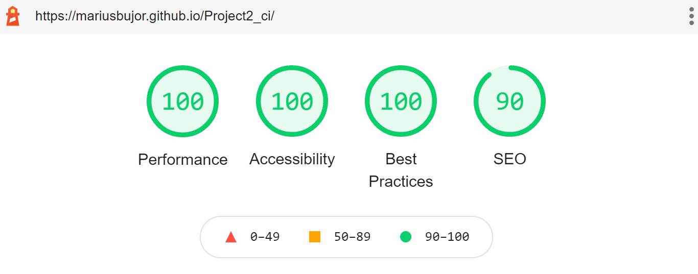
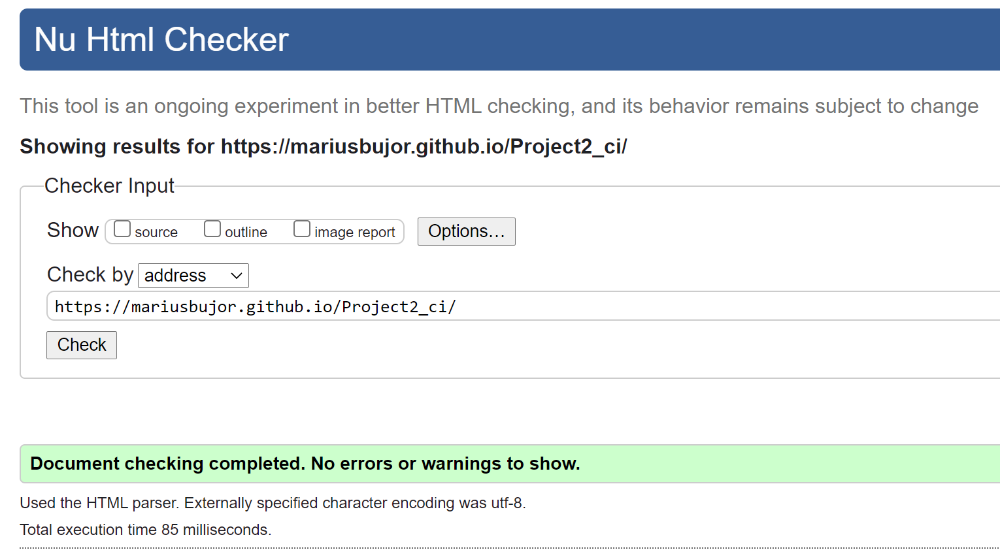
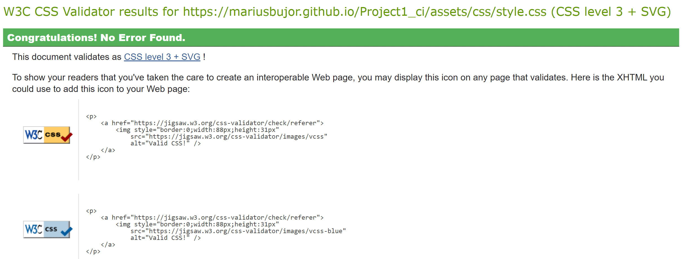
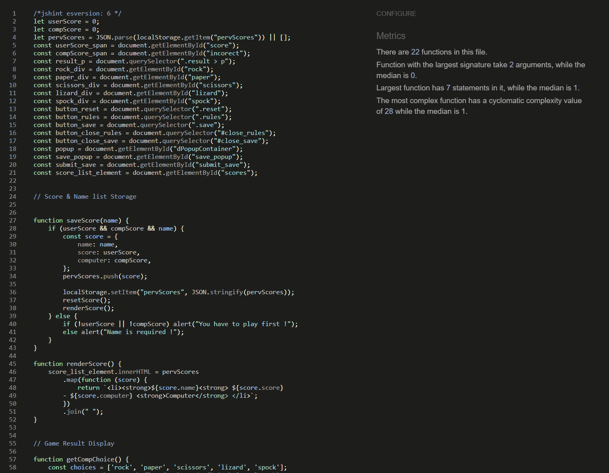
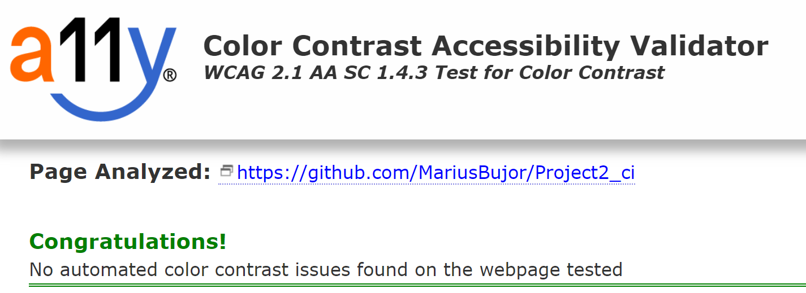

**Rock Paper Scissors Lizard Spock Game**

This is a game website called Rock, Paper, Scissors, Lizard, Spock (RPSLS)  that is a new version of the game called "Stone, Paper, Scissors", known as jan-ken-pon in Japanese, rochambeau in French and Rock-Paper-Scissors in English. Rock, Paper, Scissors, Lizard, Spock (RPSLS) was introduced by Sheldon in TV series  The Big Bang Theory adding two more options that reduce the probability and the game will result in a tie.

**[Game RULES explained by Sheldon ( video )](https://www.youtube.com/watch?v=x5Q6-wMx-K8/)**

                Game Rules :
   
              Scissors cuts Paper
              Paper covers Rock
              Rock crushes Lizard
              Lizard poisons Spock
              Spock smashes Scissors
              Scissors decapitates Lizard 
              Lizard eats Paper
              Paper disproves Spock
              Spock vaporizes Rock
              Rock crushes Scissors
                  

**[Live DEMO](https://mariusbujor.github.io/Project2_ci/)**

# Table of Contents

  - [UX](#ux) 
  - [User Stories](#user-stories)
    - [Strategy](#strategy)
      - [Main Goal](#main-goal)
    - [User Needs](#user-needs)
      - [Scope](#scope)
  - [Features](#features)
  - [Structure](#structure)
      - [Colour Palette](#colour-palette)
  - [Skeleton](#skeleton)
      - [Wireframes](#wireframes)
    - [Technology Used](#technology-used)
  - [Testing](#testing)
    - [Functionality Testing](#functionality-testing)
    - [Performance Test](#performance-test)
    - [Validator testing](#validator-testing)
  - [Accessibility](#accessibility)
  - [Compatibility](#compatibility)
  - [Unfixed Bugs](#unfixed-bugs)
  - [Deployment](#deployment)
  - [Credits](#credits)
      - [Media](#media)
      - [Code](#code)

# UX
## User Stories

Rock, Paper, Scissors ,Lizard , Spock  game  is created to be played between user  and computer.

- top middle screen is displayed the game Logo. 
- centre of the screen displays game area with five icons  :  
  - 1st icon ROCK
  - 2nd icon PAPER
  - 3rd icon SCISSORS
  - 4th icon LIZARD
  - 5th icon SPOCK
 - under game area is displayed score area for user (left) and computer (right)
 - bottom centre of the screen is displayed the :
 - RULES button that will provide the rules of the game.
 - RESET button that will provide the option to reset the score.
 - SAVE button that will provide the option to save your score 

### Strategy

#### Main Goal
- attract people of all ages to play this game. 
- reach people who are interested to play against the computer.
- reach to people who want to play a fast , easy and fun game.

### User Needs
#### Scope

- to have the option to be played everywhere.
- to provide instructions how to play the game.
- to have an responsive design on phone ,tablet and desktop.
- players to enjoy the experience playing this game.
  
## Structure
 - I want the game to be entertaining ,easy to understand the rulse and play. 
 - the interface responds to user actions as as expected 
 - all buttons respond normal when hovered are press (helps the user to quickly learn de functionality)
  
### Colour Palette 

  [Abode Color]( https://color.adobe.com/search?q=1B262C&t=hex) was used to extract the main colours fo the website:
  
  

 ## Features

[Title - photo](https://github.com/MariusBujor/Project2_ci/blob/main/assets/images/logo.jpg)
- Logo photo that displays the game implemented as header of the page.

[Game Area - photo](https://github.com/MariusBujor/Project2_ci/blob/main/assets/images/screen/gamearea.PNG) 
- User choices to play against computer.

[Result Area - photo](https://github.com/MariusBujor/Project2_ci/blob/main/assets/images/clickandplay.PNG) 
- User and computer choices will be displayed and the result if user wins against computer or he lost.

[Score Area - photo](https://github.com/MariusBujor/Project2_ci/blob/main/assets/images/screen/scorearea.PNG) 
- Displays User and Computer score. Maximum score is 10.

#### Buttons :

[Rules - photo](https://github.com/MariusBujor/Project2_ci/blob/main/assets/images/screen/rulesbutton.PNG) 
- User can remind himself the rules of the game by pressing on Rules button

[Reset - photo](https://github.com/MariusBujor/Project2_ci/blob/main/assets/images/screen/resetbutton.PNG) 
- User can reset the score at any time by pressing Reset button.

[Save - photo](https://github.com/MariusBujor/Project2_ci/blob/main/assets/images/screen/savebutton.PNG)
- User can save the scores and his name at any time of the game by pressing Save button.

[Save Popup - photo](https://github.com/MariusBujor/Project2_ci/blob/main/assets/images/screen/scoresavepopup.PNG) 
- Displays the form where user can insert his name to record the score

## Skeleton
### Wireframes 
 
- Landing page :  [mobile](https://github.com/MariusBujor/Project2_ci/blob/main/docs/wireframes/homepage_mobile.PNG) , [desktop](https://github.com/MariusBujor/Project2_ci/blob/main/docs/wireframes/homepage_desktop.PNG)
  
- Rules displayed : [mobile](https://github.com/MariusBujor/Project2_ci/blob/main/docs/wireframes/mobile_rules.PNG), [desktop](https://github.com/MariusBujor/Project2_ci/blob/main/docs/wireframes/mobile_rules.PNG)

### Technology Used 
- HTML
- CSS
- JavaScript
- Libraries [Google Fonts](https://fonts.googleapis.com/css2?family=Roboto+Slab:wght@800&display=swap)
  
## Testing

### Functionality Testing
### Performance Test 
  

  
### Validator testing
  * HTML
  - No errors were returned when passing through the   official [w3c html validator](https://validator.w3.org/).
  
  

  * CSS
  - No errors were found when passing through the official [w3c jigsaw validator](https://jigsaw.w3.org/css-validator/).
  - 
   

  * JavaScript
  
  - No errors were found when passing through the official [JSHINT](https://jshint.com/)
  
  .

  ### Accessibility

  Accessibility was tested with both Chrome Lighthouse [a11y contrast checker](https://color.a11y.com/)  and no issues were found. 

  ### Compatibility
  ### Unfixed Bugs
  - No bugs to be fixed

  ### Deployment

- Git Hub Pages
  
  - The project was deployed to GitHub Pages using the following steps:

   1 Log in to GitHub and locate the Rock Paper Scissors Lizard Spock Game Repository

   2 At the top of the Repository, locate and click the "Settings" Button on the menu

  3 Scroll down the Settings page until you locate the "GitHub Pages" Section.

  4 Under "Source", click the dropdown called "None" and select "main" branch.

  5 The page will automatically refresh.

  6 Scroll back down through the page to locate the now published [Project2_ci](https://mariusbujor.github.io/Project2_ci/) in the "GitHub Pages" section.

### Credits

[YouTube video](https://www.youtube.com/watch?v=6I3qMe-jXDs) by dcode - how to use JSON.

[YouTube video](https://www.youtube.com/watch?v=fM5qnyasUYI) by freeCodeCamp.org - how to use switch statement.

  
#### Media
   - Images used were taken from :
     - [Aislingleavy](https://aislingleavy.files.wordpress.com/2012/05/rock-paper-scissors.png)
     - [Nicepng](https://www.nicepng.com/ourpic/u2t4i1w7i1u2i1q8_rock-paper-scissors-lizard-spock-wedding-invitation/)
  - All images have been resized and compressed in order to boost the UX flow.
  
#### Code
[Love Maths Project](https://learn.codeinstitute.net/courses/course-v1:CodeInstitute+LM101+2021_T1/courseware/2d651bf3f23e48aeb9b9218871912b2e/234519d86b76411aa181e76a55dabe70/) by Code Institute as a general resource.

[W3School](https://www.w3schools.com/) as a general resource.

[Stackoverflow](https://stackoverflow.com/) as a general resource.

